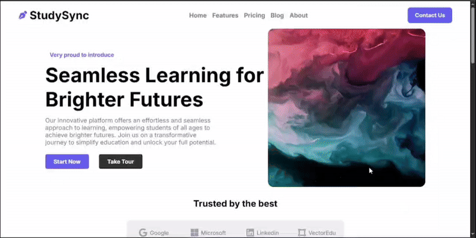

# StudySync🖋

This is the first fully responsive webpage I ever built — and it’s special to me! 🎉  
I followed Love Babbar sir’s web dev playlist while creating it, and it really helped me understand how HTML and CSS work together to make real websites.  
This was the project where I first started seeing web development differently — not just as code, but as something beautiful that people interact with. I was honestly so happy while making this!  

## What I Learned 🧠  
- Structuring a webpage with semantic HTML.  
- Styling with modern CSS (variables, media queries, animations).  
- Creating responsive layouts that look great on all screen sizes.  
- Using Google Fonts and SVG icons for a clean design.  
- Adding hover effects and subtle animations for polish.  

## Features 🚀  
- Clean and fully responsive design.  
- Smooth animations on sections.  
- Reusable CSS variables for colors and fonts.  
- A company logo grid, feature cards, testimonial cards, and a newsletter section.  
- A well-organized footer with quick links and social media icons.  

## Usage  
Simply open `index.html` in any modern browser — everything works offline!  

## 🎥 Project Demo — Responsive Design in Action

### 💻 Desktop View


### 📱 Mobile / Tablet View


## Project Structure 📂  
```
studysync-responsive-webpage/
│
├── index.html        # Main HTML file (webpage structure)
├── style.css         # Styling (responsive design, animations, layout)
├── images/           # All images, logos, and icons used in the project
├── assets/           # Demo Videos
└── README.md         # Project documentation (this file)
```
